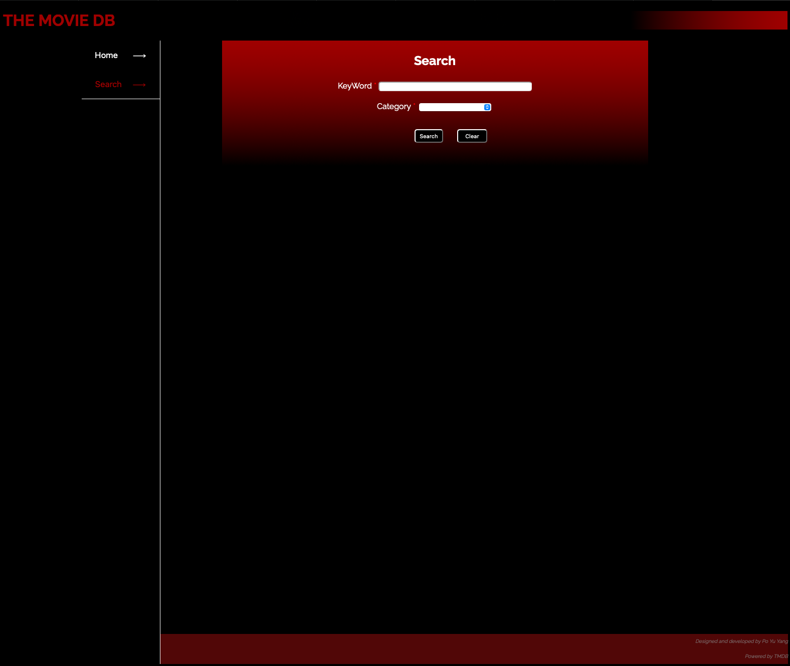

# TMDB Search Engine

##  Overview

In this project, i built a TMDB full stack website for user to search Move and TV Show they want

## HomePage

The Home page of this website

## SearchTab

Search function 

## Input for Search

User can type the movie name or tv show name they want 

## Result of Search

All the result will be shown below

## Show more 

After pressing Show More button, the modal will pop out, including the cast and review information

